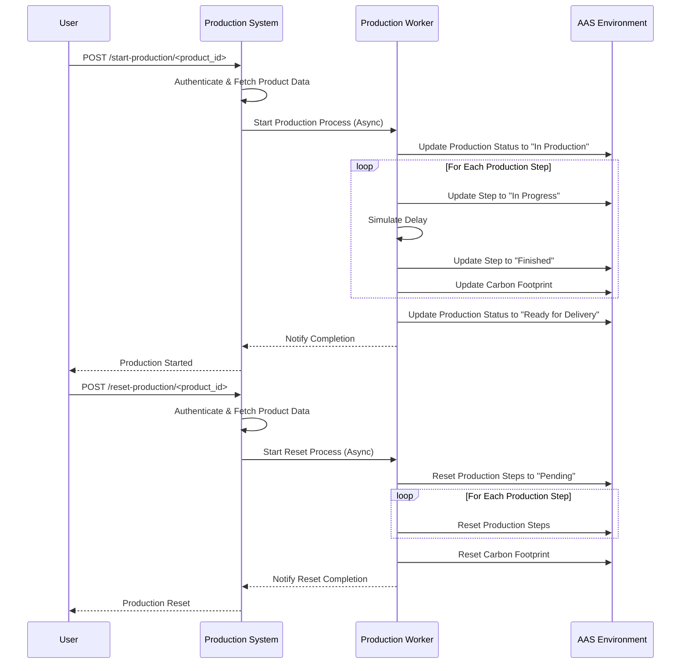

This demo shows the prodcution scheduling in a factory and also calculates the carbon footprint after each production steps. It also demonstrates the access levels of different users, for e.g., an Administrator can access all the AASs and its Submodels, but different customers can access only granted AAS including only ProdutionStatus, Order, and CarbonFootprint Submodels.

## Potential problems

It is possible that the line ending of 'entrypoint.sh' changes from LF to CRLF when checking out to a Windows host. Please check and change if necessary (e.g. in Notepad++ or VSCode), otherwise the security submodel cannot be initialized.

## Running the demo

To run the demo containers, you need to have Docker installed on your device.


### Setup Hostname in .env

If the demo is not to run on the local host, the respective host name and port must be defined in the .env file. In addition, a proxy can be specified so that APT and Maven have access to the repositories during the installation. The port that must be specified is basically the port to which the reverse proxy (nginx) listens and forwards the incoming requests to the respective services.


### Run the BaSyx containers including the Production Scheduler container

```sh
docker compose up -d
```

### How to use

1. Open Postman
2. Import the [collection](./Demo-Batterycell-RBAC.postman_collection.json)
3. Go through the following steps to start production and and visualize in the AAS GUI


## Scenario

### Login and uploading AAS
1. Log in to the UI with Admin account to show case all AAS availability for Admin. The address of the UI depends on the HOSTNAME setting from .env. On localhost it would be http://localhost/aas-gui/

```
username: d4e.admin
password: changeit
```


2. Upload the AAS 'EntireProductBatteryCell.json' located in ./aas.

3. Now, click on Logout button (Top Right icon)
4. Login with an customer user account like Customer One. At the beginning, Customer One does not see any AAS. The Plan is to give the customer permissions to view their's and only their's AAS (DPPProductID1):

```
username: customer.one
password: changeit
```

### Applying dynamic RBAC rules

Now, using the Dynamic RBAC Management, we will be sharing the AASs within the
Dataspace and give Customer One access to their AAS.

Manufacturer receives production order from Customers and shares the AAS limiting
access to only 'Order' and 'CarbonFootprint'.
First, Manufacturer provides access to the Customer One as below:
The Manufacturer adds the policies for the Customer One for Read access.
4 rules needs to be added one each for AAS Reg, AAS Repo, SM Reg, and SM
Repo.

1. Open Postman
2. Go to collection Demo-Batterycell-Local -> Rules -> CustomerOne
3. Execute all the requests under CustomerOne folder in a sequence (if you
encounter 401, switch to Authorization Tab inside Postman request and go to the
very bottom and hit "Get New Access Token" and then again Send Request).
4. Now head to the AAS GUI and login as Customer One again.
5. The DPPProductID1 will now be displayed on Customer One's account.
6. Now click on DPPProductID1 on the GUI - only Order and CarbonFootprint
Submodels are authorized and visible.
7. Now click on DPPProductID1 on the GUI -> Order -> ProductionStatus
8. Try to change the value, it will throw 403
Demonstrate that it is not possible to modify the Data from Customer's side.

The same can be repeated for the remaining Customer Two, Three and Four.

### Starting the Production Scheduler
The Production Scheduler dynamically changes the values for 'Order' and 'CarbonFootprint'.
To start it, simply execute the “StartProduction” rule in Postman under “Production”. Depending on which AAS is passed as a parameter (e.g. {{dpp_prod_id_1}}), you can now see in the AAS that the values for 'Order' and 'CarbonFootprint' change.

Make sure to enable 'Auto Sync' within the UI to see the changes.





